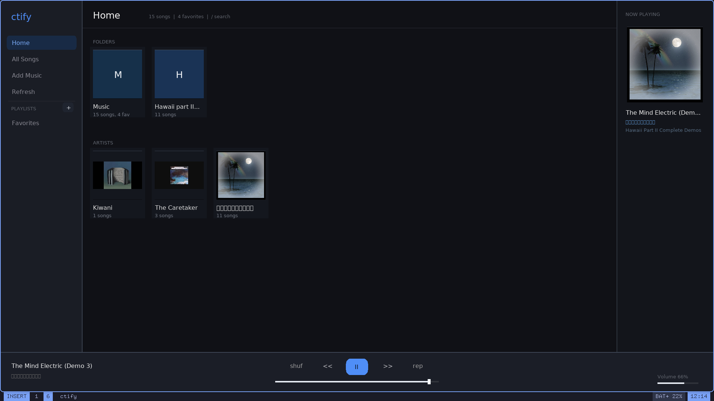
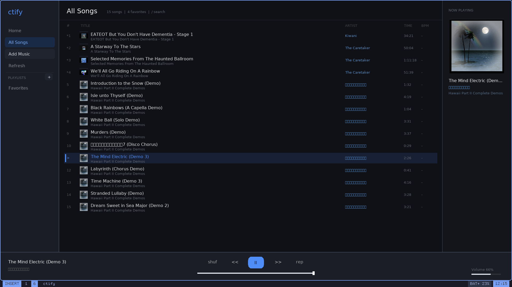
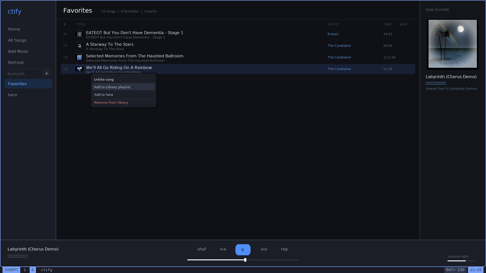

# ctify

`ctify` is a small local music player for Linux written in C. It scans
`~/Music` by default, shows your local tracks in a Soundwave-style SDL
interface, and uses `mpv` as the playback backend.

Supported audio extensions: `.mp3`, `.flac`, `.ogg`, `.m4a`, `.wav`, `.aac`,
`.opus`, and `.wma`.

## Screenshots







## Dependencies

- C compiler
- `make`
- `pkg-config`
- SDL2
- SDL2_ttf
- SQLite3
- `mpv`
- `ffmpeg` / `ffprobe` for metadata and album covers

Examples:

- Arch Linux / Artix Linux: `sudo pacman -S --needed git base-devel pkgconf sdl2 sdl2_ttf sqlite mpv ffmpeg`
- Debian / Ubuntu: `sudo apt install git build-essential pkg-config libsdl2-dev libsdl2-ttf-dev libsqlite3-dev mpv ffmpeg`
- Fedora: `sudo dnf install git gcc make pkgconf-pkg-config SDL2-devel SDL2_ttf-devel sqlite-devel mpv ffmpeg`
- openSUSE: `sudo zypper install git gcc make pkg-config libSDL2-devel SDL2_ttf-devel sqlite3-devel mpv ffmpeg`
- Gentoo: `sudo emerge --ask dev-vcs/git sys-devel/gcc sys-devel/make virtual/pkgconfig media-libs/libsdl2 media-libs/sdl2-ttf dev-db/sqlite media-video/mpv media-video/ffmpeg`
- Alpine: `sudo apk add git build-base pkgconf sdl2-dev sdl2_ttf-dev sqlite-dev mpv ffmpeg`

## Full Install Example

Minimal install:

```sh
git clone https://github.com/Vifuddyxg/ctify
cd ctify
make
sudo make install
```

Run after installing:

```sh
citify
ctify
ctify /path/to/music
```

`make install` installs `/usr/local/bin/ctify`, a `/usr/local/bin/citify`
alias, and the desktop launcher used by application menus and `drun`.

Run without installing:

```sh
./ctify
./ctify /path/to/music
```

## Controls

- Click a track: play it immediately
- Click a Home card: open a folder or artist
- Click `Add Music`: pick audio files and add them to the library
- Click `Refresh`: rescan the library and reload metadata/artwork
- Right-click a track: open actions for like, add to playlist, or remove
- Right-click a Home folder card: favorite/unfavorite all tracks in that folder
- Right-click a playlist in the sidebar: delete it
- `Space`: pause/resume the current track
- `Enter`: play/pause selected track
- `1` / `2` / `3`: Home, All Songs, Favorites
- Arrow keys: move selection
- Mouse wheel / PageUp / PageDown: scroll
- `/`: search
- `o`: open the Add Music file picker
- `n`: next track
- `b`: previous track
- `f`: favorite/unfavorite selected track
- `Shift+f`: favorite/unfavorite all tracks in the current view
- `a`: add selected track to the `Library` playlist
- `Shift+a`: add all tracks in the current view to the current playlist, or to `Library`
- `p`: create a new playlist with a typed name
- `d`: delete the active playlist
- `s`: shuffle on/off
- `t`: repeat on/off
- `m`: sort by BPM on/off
- `[` / `]`: previous/next chapter or part
- `+` / `-`: volume up/down
- `Delete`: remove selected track from the local library database
- Drag/click the progress bar: seek
- Drag/click the volume bar: set volume
- `r`: rescan library
- `Esc`: close search or quit

## Library State

`ctify` stores lightweight library state in `~/.local/state/ctify`:

- `favorites.txt`: favorite tracks
- `library.db`: SQLite library index and imported folders
- `playback_state.txt`: last track, seek position, volume, shuffle, and repeat
- `playlists/*.m3u`: playlists shown in the sidebar
- `covers/`: extracted album artwork cache

You can add a playlist manually by creating a `.m3u` file in that folder with
one track path per line.
